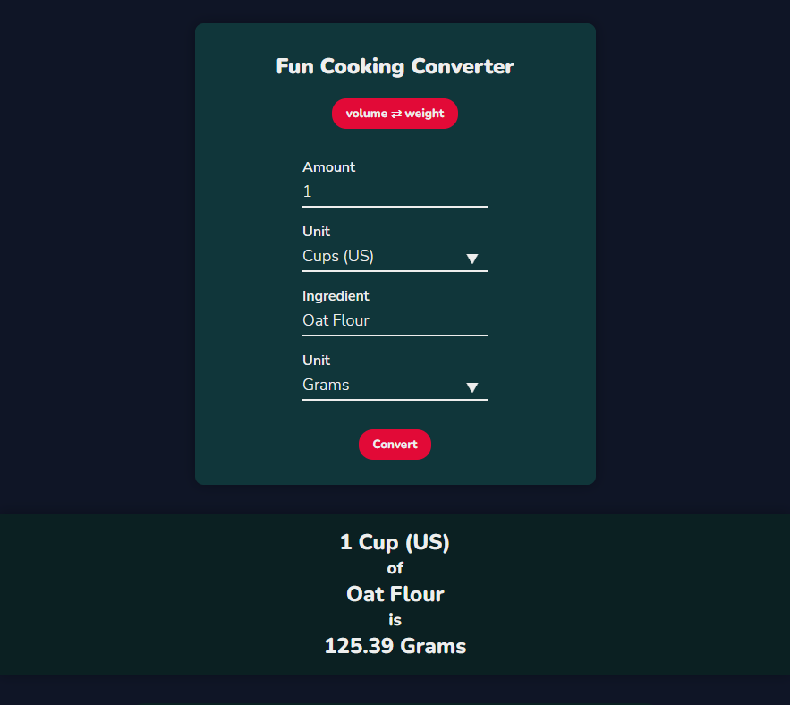

# Fun-Cooking-Converter
Convert ingredients between weight and volume values

  ## Table Of Contents
  - [Link (Deployed Application)](#link)
  - [Description](#description)
  - [Technologies](#technologies)
  - [Screenshots](#screenshots)
  - [Installation](#installation)
  - [Questions](#questions)

## Link

[Click Here](https://benbasic.github.io/Fun-Cooking-Converter/)

## Description

Fun Cooking Converter helps you convert common cooking ingredients between weight and volume values. Wonder how many grams are in a cup of white rice? What about how many liters will fill up from a pound of brown sugar? The Fun Cooking Converter is here to help!

## Technologies
  HTML, CSS, JavaScript, React

## Screenshots

## Installation

If you clone this repo and run it on your computer, you can install it doing the following in the terminal:

1) Type in npm i to install packages
2) Type in npm start
3) You are now free to use the Fun Cooking Converter. Alternatively, it's much easier to click this link instead to use it [Click Here](https://benbasic.github.io/Fun-Cooking-Converter/)

## Questions

This repo was created by https://github.com/BenBasic
To contact me, please send an email to BenjaminYBasic@gmail.com
  